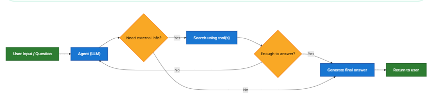

# RAG
参考文档：https://docs.langchain.com/oss/python/langchain/retrieval#rag-architectures
## RAG工作流
1. 检索：对用户输入，用检索器在知识库中查找相似的文本段
2. 生成：模型使用问题和检索结果进行生成

## RAG三种架构
|架构|描述|使用实例
|----|---|-------
|2-step RAG|在llm生成之前检索|对话解答机器人，文档答疑助手
|Agentic RAG|由agent决定在推理中何时以及如何检索|有多种工具的研究主力
|Hybrid|上两种的结合体|特定领域的回答

### 2-step RAG

在llm生成答案前检索

### Agentic RAG

agent决定在什么时候检索知识库
- 如果agent认为当下不足以回答，就会继续检索
- 反之，如果agent认为当下足以回答，救会直接输出

